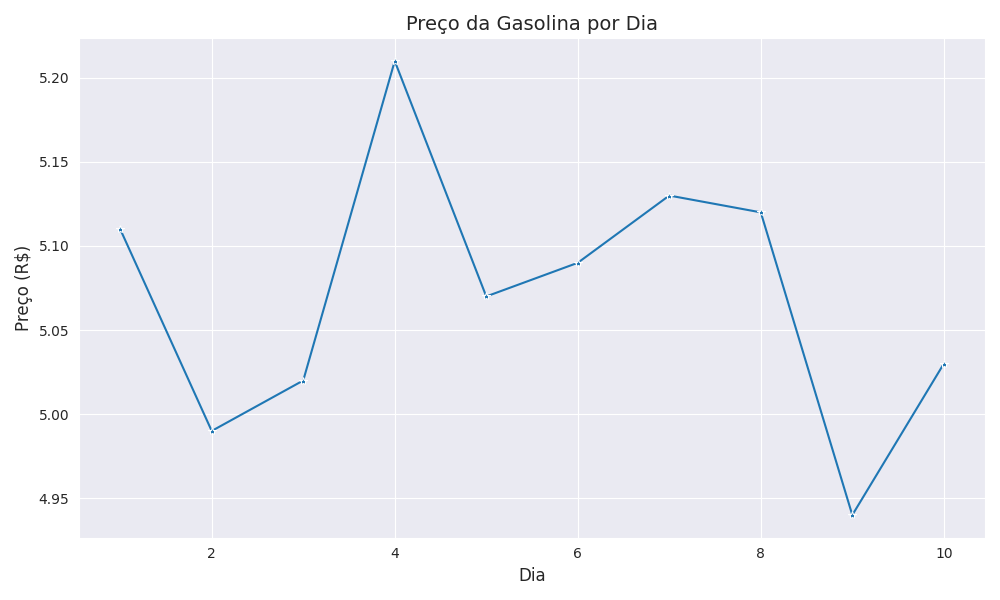

# Análise de Preços da Gasolina ⛽

## Visão Geral

Este projeto é um exercício do curso da Ebac sobre Git e GitHub. Ele demonstra como:

* Utilizar o Git para controle de versão.
* Criar um repositório no GitHub e enviar alterações.
* Gerar um gráfico simples com Python (Pandas, Matplotlib e Seaborn) para visualizar dados.

## Gráfico

[](gasolina.png)

O gráfico acima mostra a variação do preço da gasolina ao longo do tempo, utilizando os dados do arquivo `gasolina.csv`.

## Código

O código Python responsável por gerar o gráfico está no arquivo `gasolina.py`. Ele utiliza as seguintes bibliotecas:

* **Pandas:** Para leitura e manipulação dos dados.
* **Matplotlib:** Para criar a estrutura do gráfico.
* **Seaborn:** Para estilizar o gráfico e adicionar elementos visuais.

## Como Executar

1. **Clone o Repositório:**
   ```bash
   git clone https://github.com/TonFLY/ebac_github2.git
